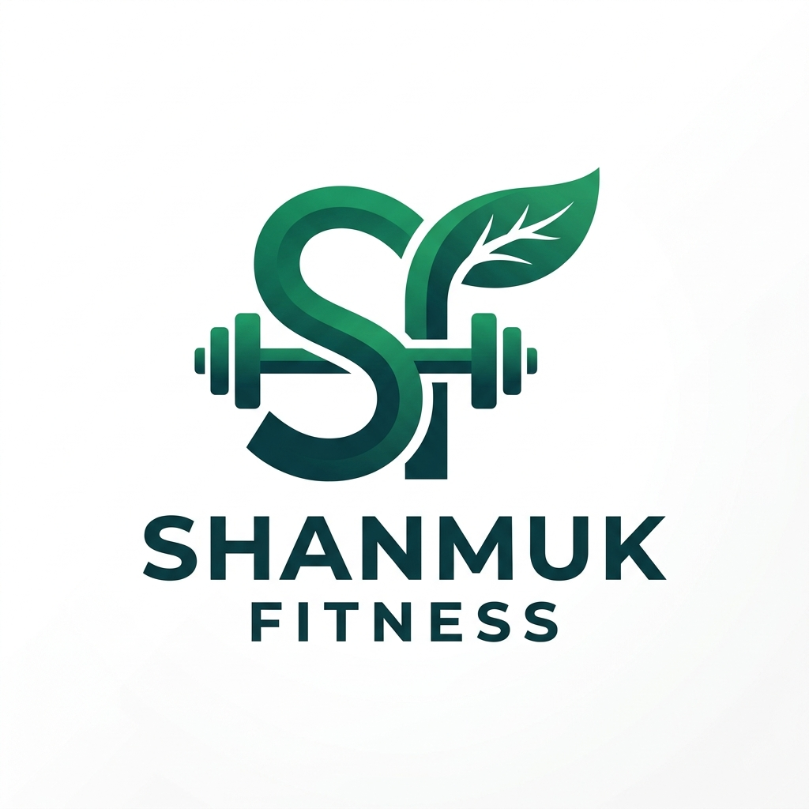

# Shanmuk Fitness & Diet Coaching Platform

A complete, modern, premium **Gym & Diet Coaching Web Application for Coach Shanmuk** built using React.js (JSX), Vite, Tailwind CSS v3, React Router DOM, Recharts, Framer Motion, and React Hook Form with Zod validation.



---

## ⚡ Features & Capabilities

- **Single-Source WhatsApp Integration**:
  - Configurable WhatsApp number (`918317688770`) in `src/config/constants.js`.
  - Floating pulse-animated WhatsApp action button with official WhatsApp vector SVG icon.
  - Pre-filled encoded message URLs across all CTA buttons.

- **Hero Auto-Scrolling Image Carousel**:
  - Automatically rotates high-resolution Gym workout action visuals and Gourmet high-protein diet visuals every 3.5 seconds.
  - Live badges for exercises, calories, macros, and Coach Shanmuk online status.

- **Crisp White Theme UI**:
  - Light mode palette with emerald highlights (`#10b981`), slate typography (`text-slate-900`), and smooth glassmorphism shadows.

- **Structured Workout Catalog & Routines**:
  - Beginner (3 Days / Full Body), Intermediate (4 Days / Upper-Lower), and Advanced (5-6 Days / PPL) routines.
  - Day-by-day exercise schedules with sets, reps, rest timers, required equipment, step-by-step form instructions, and Coach Shanmuk tips.

- **Customized Diet Plans & Macro Timelines**:
  - Weight Loss, Muscle Gain, High Protein, Vegetarian, and Balanced diets.
  - Daily timeline meal schedules (Breakfast, Mid-morning, Lunch, Evening, Dinner, Before bed) with protein, carb, fat, and calorie breakdowns.

- **Interactive Progress Dashboard**:
  - Powered by **Recharts**.
  - 12-week body weight progression line chart.
  - Weekly calorie burn bar chart.
  - Streak counters and active 7-day schedule grid.

- **Form Validation**:
  - React Hook Form + Zod schema validation on the Contact page.

---

## 🛠️ Technology Stack

- **Frontend Core**: React.js (JSX), Vite
- **Styling**: Tailwind CSS v3, PostCSS, Autoprefixer
- **Routing**: React Router DOM v6
- **Data Visualization**: Recharts
- **Animations**: Framer Motion
- **Form Handling**: React Hook Form, Zod, `@hookform/resolvers`
- **Icons**: Lucide React & Custom WhatsApp Vector SVG

---

## 🚀 Getting Started

### 1. Installation

```bash
# Clone the repository
git clone https://github.com/riyaz-freelancing/Shanmuk-Website.git
cd Shanmuk-Website

# Install dependencies
npm install
```

### 2. Run Development Server

```bash
npm run dev
```

Open [http://localhost:5173](http://localhost:5173) in your browser.

### 3. Production Build

```bash
npm run build
```

---

## 📱 WhatsApp Configuration

To update the WhatsApp phone number or default message, edit `src/config/constants.js`:

```javascript
export const SITE_CONFIG = {
  whatsappNumber: "918317688770", // Edit number here
};
```

---

## 📄 License

Created for **Shanmuk Fitness & Diet Coaching**. All rights reserved.
